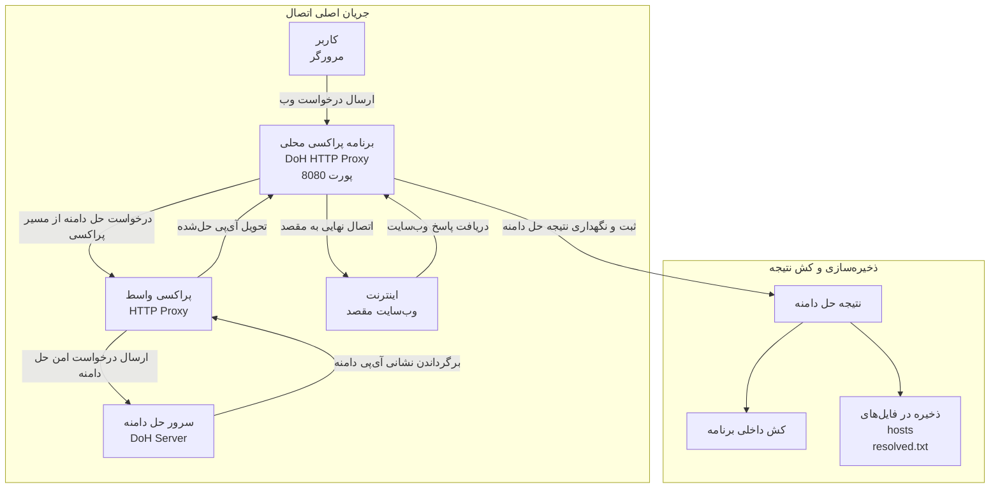

<div align="right" dir="rtl">

# راهنمای مشارکت در پروژه DoH HTTP Proxy

این فایل برای کمک به مشارکت‌کنندگان جدید نوشته شده است تا سریع‌تر با ساختار فنی پروژه آشنا شوند و بتوانند تغییرات خود را
با کمترین اصطکاک وارد مخزن کنند.

## هدف پروژه

این پروژه، به منظور پوشش سناریوهای زیر ایجاد شده است:

<ul dir="rtl" align="right">
  <li>استفاده بهتر و بهینه‌تر از DoH</li>
  <li>عدم دسترسی کاربر به DNS در مقاطع زمانی خاص</li>
</ul>

## نمای فنی کوتاه

هسته‌ی برنامه در `main.py` ([توضیحات بیشتر](https://github.com/SAMPA-ASA/DoH-HTTP-Proxy/blob/main/MAIN_STRUCTURE.md)) قرار دارد و چند مسئولیت اصلی را
پوشش می‌دهد:

<ul dir="rtl" align="right">
  <li>دریافت درخواست‌های HTTP/HTTPS از کلاینت</li>
  <li>resolve کردن دامنه‌ها از طریق چند endpoint DoH</li>
  <li>استفاده از fallback در صورت خطا یا timeout</li>
  <li>cache کردن IPهای مناسب‌تر برای اتصال</li>
  <li>ثبت دامنه‌های resolve شده در فایل خروجی</li>
  <li>به‌روزرسانی <code>hosts</code> در صورت فعال بودن این قابلیت و اجرای برنامه با دسترسی لازم</li>
  <li>مدیریت پروکسی سیستم و upstream proxy  </li>
</ul>
نکات مهم برای توسعه‌دهندگان:

<ul dir="rtl" align="right">
  <li>منطق شبکه، cache و تنظیمات در یک فایل متمرکز شده است، پس تغییرات کوچک هم ممکن است روی چند بخش اثر بگذارد.</li>
  <li>تست‌ها با <code>unittest</code> نوشته شده‌اند و برای رفتارهای حساس مثل تشخیص پورت و آمار ترافیک استفاده می‌شوند.</li>
</ul>

## ساختار مخزن

<ul dir="rtl" align="right">
  <li><code>CONTRIBUTING.md</code> راهنمای مشارکت</li>
  <li><code>LICENSE</code> مجوز</li>
  <li><code>MAIN_STRUCTURE.md</code> جزئیات ساختار فایل <code>main.py</code></li>
  <li><code>main.py</code>: منطق اصلی پروکسی</li>
  <li><code>README.md</code>: توضیحات کاربر نهایی و نحوه استفاده</li>
  <li><code>doh-list.txt</code>: فهرست endpointهای DoH</li>
  <li><code>run_proxy.bat</code>: اجرای ساده در ویندوز</li>
  <li><code>tests/</code>: تست‌های واحد</li>
</ul>

## دیاگرام اتصال (با تنظیمات پیش‌فرض):

## پیش‌نیازها

برای اجرای نسخه‌ی سورس، Python و وابستگی‌های زیر لازم است:
<div dir="ltr" align="left">

```powershell  
pip install requests dnspython  
```  

</div>

اگر وابستگی جدیدی اضافه می‌کنید، فقط به کد بسنده نکنید و مستندات را هم به‌روزرسانی کنید.

## اجرای پروژه

اجرای برنامه از سورس:
<div dir="ltr" align="left">

```powershell  
python main.py  
```  

</div>

اجرای با آرگومان:
<div dir="ltr" align="left">

```powershell  
python main.py --listen 127.0.0.1 --port 8080 --verbose  
```  

</div>

## اجرای تست‌ها

برای اجرای کل تست‌ها:
<div dir="ltr" align="left">

```powershell  
python -m unittest discover -s tests  
```  

</div>
اگر فقط می‌خواهید یک فایل خاص را بررسی کنید:  
<div dir="ltr" align="left">

```powershell  
python -m unittest tests.test_traffic_stats  
```  

</div>

## استانداردهای مشارکت

### 1) تغییرات کوچک و قابل بررسی

تا حد ممکن هر PR باید یک هدف مشخص داشته باشد. تغییرات بزرگ را به چند بخش کوچک‌تر تقسیم کنید:

<ul dir="rtl" align="right">
  <li>اصلاح رفتار</li>
  <li>اضافه کردن تست</li>
  <li>به‌روزرسانی مستندات</li>
</ul>

### 2) تست‌محور عمل کنید

اگر باگ را برطرف می‌کنید، در صورت امکان، تستی اضافه کنید که همان مشکل را بازتولید کند یا رفتار جدید را قفل کند.

### 3) سازگاری با ویندوز را حفظ کنید

این پروژه بر روی ویندوز اجرا می‌شود. قبل از تغییر در بخش‌های زیر، اثر جانبی را بررسی کنید:

<ul dir="rtl" align="right">
  <li><code>hosts</code></li>
  <li><code>WinINET</code> / proxy settings</li>
  <li>دسترسی Administrator</li>
  <li>رفتار socket و timeout</li>
</ul>

### 4) تغییرات شبکه را با احتیاط انجام دهید

هر تغییری در این نواحی باید با دقت بررسی شود:

<ul dir="rtl" align="right">
  <li>resolve کردن DoH</li>
  <li>fallback بین endpointها</li>
  <li>انتخاب IP مناسب</li>
  <li>cache و TTL</li>
  <li>proxy chaining</li>
</ul>

### 5) مستندات را هم‌زمان به‌روزرسانی کنید

اگر رفتار کاربر، آرگومان‌های خط فرمان، فایل تنظیمات یا فرمت خروجی تغییر می‌کند، این فایل‌ها را هم اصلاح کنید:

<ul dir="rtl" align="right">
  <li><code>README.md</code></li>
  <li><code>doh-list.txt</code> در صورت نیاز</li>
  <li><code>MAIN_STRUCTURE.md</code> در صورت نیاز</li>
  <li>توضیحات تست‌ها</li>
</ul>

## سبک کدنویسی

<ul dir="rtl" align="right">
  <li>از نام‌گذاری روشن و مستقیم استفاده کنید.</li>
  <li>منطق پیچیده را به تابع‌های کوچک‌تر تقسیم کنید.</li>
  <li>برای تغییرات حساس شبکه، توضیح کوتاه در کنار کد اضافه کنید.</li>
  <li>از بازنویسی بی‌دلیل بخش‌های پایدار پرهیز کنید.</li>
</ul>

## هنگام اضافه کردن قابلیت جدید

قبل از ارسال PR این موارد را بررسی کنید:

<ul dir="rtl" align="right">
  <li>آیا قابلیت جدید با تنظیمات فعلی سازگار است؟</li>
  <li>آیا در حالت بدون اینترنت یا با DNS خراب هم رفتار قابل قبول دارد؟</li>
  <li>آیا خروجی جدید با منطق cache و fallback تداخل ندارد؟</li>
  <li>آیا تست کافی برای رفتار جدید نوشته شده است؟</li>
</ul>

## گزارش باگ

اگر باگ پیدا کردید، بهتر است گزارش شامل این موارد باشد:

<ul dir="rtl" align="right">
  <li>نسخه‌ی Python</li>
  <li>نسخه یا commit پروژه</li>
  <li>سیستم‌عامل</li>
  <li>مراحل بازتولید</li>
  <li>فایل‌های تنظیمات مؤثر</li>
  <li>لاگ یا پیام خطا</li>
  <li>نتیجه‌ی مورد انتظار و نتیجه‌ی واقعی</li>
</ul>

## نکات امنیتی

<ul dir="rtl" align="right">
  <li><code>insecure_doh_tls</code> فقط برای شرایط خاص است و نباید به‌عنوان حالت عادی استفاده شود.</li>
  <li>تغییر فایل <code>hosts</code> نیازمند دسترسی مناسب است و باید با دقت انجام شود.</li>
  <li>اگر از upstream proxy یا DoH proxy استفاده می‌کنید، مطمئن شوید آدرس‌ها درست و قابل اعتماد هستند.</li>
</ul>

## پیشنهاد برای PR

ساختار پیشنهادی هر PR:

<ul dir="rtl" align="right">
  <li>شرح کوتاه تغییر</li>
  <li>دلیل انجام تغییر</li>
  <li>تست‌های اجراشده</li>
  <li>اثر جانبی احتمالی</li>
</ul>

## هماهنگی

اگر تغییر شما روی بخش‌های حساس هسته‌ی شبکه اثر می‌گذارد، بهتر است قبل از ادغام نهایی، تست‌های مرتبط را اجرا کنید و نتیجه
را در توضیحات PR بنویسید.

</div>
